# 🛒 MERN Shop – Full Stack E-Commerce Platform

A modern and fully responsive e-commerce application built with the MERN stack (MongoDB, Express.js, React, and Node.js).

This project provides a complete online shopping experience, including authentication, product management, shopping cart, wishlist, order tracking, online payments, notifications, and an advanced admin dashboard.

---

## 🚀 Live Demo

### Frontend
Coming Soon

### Backend API
Coming Soon

---

## ✨ Features

### 👤 User Features

- User registration and login
- JWT authentication
- Email verification with OTP
- Forgot password using OTP
- User profile management
- Product search and filtering
- Product sorting and pagination
- Product reviews and ratings
- Shopping cart
- Wishlist management
- Checkout process
- Razorpay payment integration
- Order history
- Invoice PDF generation
- Notification system
- Responsive mobile-friendly design

---

### 👨‍💼 Admin Features

- Admin authentication
- Dashboard analytics
- Product management (CRUD)
- User management
- Order management
- Revenue statistics
- Low-stock product monitoring
- Sales reports
- Charts and analytics

---

## 🛠️ Technology Stack

### Frontend

- React.js
- Vite
- React Router DOM
- Axios
- React Toastify
- React Icons
- Chart.js
- CSS3

---

### Backend

- Node.js
- Express.js
- JWT Authentication
- bcrypt.js
- Multer
- Cloudinary
- PDFKit

---

### Database

- MongoDB Atlas
- Mongoose

---

### Payment Gateway

- Razorpay

---

### Deployment

- Render
- Vercel

---

## 📂 Project Structure

```bash
mern-ecommerce/
│
├── client/
│   ├── public/
│   ├── src/
│   │   ├── components/
│   │   ├── context/
│   │   ├── pages/
│   │   ├── services/
│   │   ├── App.jsx
│   │   └── main.jsx
│   │
│   └── package.json
│
├── server/
│   ├── config/
│   ├── controllers/
│   ├── middleware/
│   ├── models/
│   ├── routes/
│   ├── uploads/
│   └── server.js
│
├── screenshots/
│
└── README.md
```

---

## 📸 Screenshots

### 🏠 Home Page

Displays:

- Hero section
- Product search
- Category filters
- Product grid
- Pagination

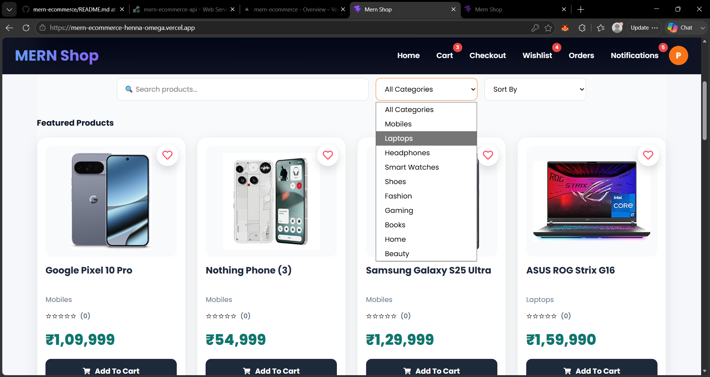

---

### 📱 Product Details Page

Displays:

- Product image
- Product description
- Reviews and ratings
- Add to Cart button
- Wishlist button

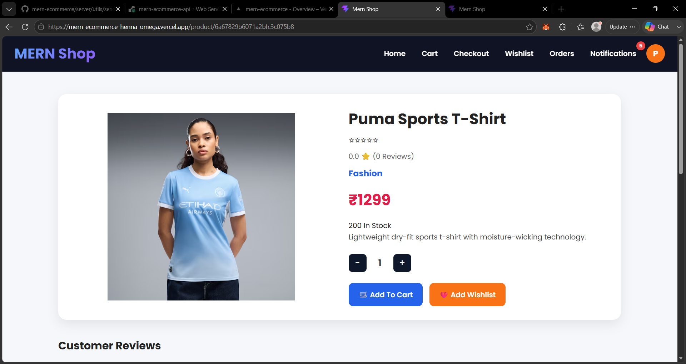

---

### 🛒 Cart Page

Displays:

- Selected products
- Quantity management
- Price summary
- Remove item option

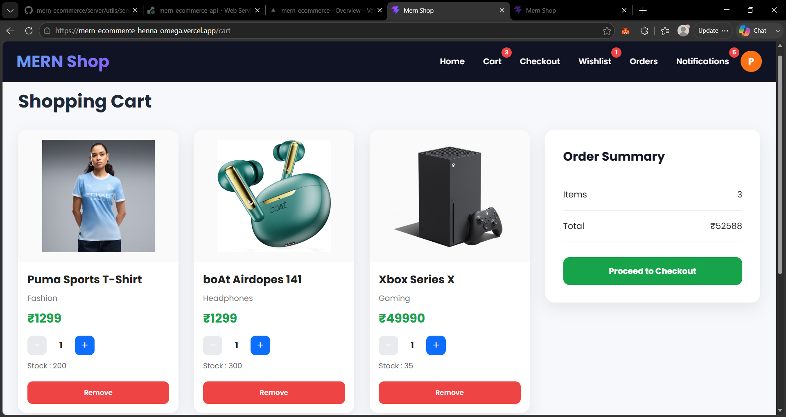

---

### ❤️ Wishlist Page

Displays:

- Saved products
- Remove from wishlist option

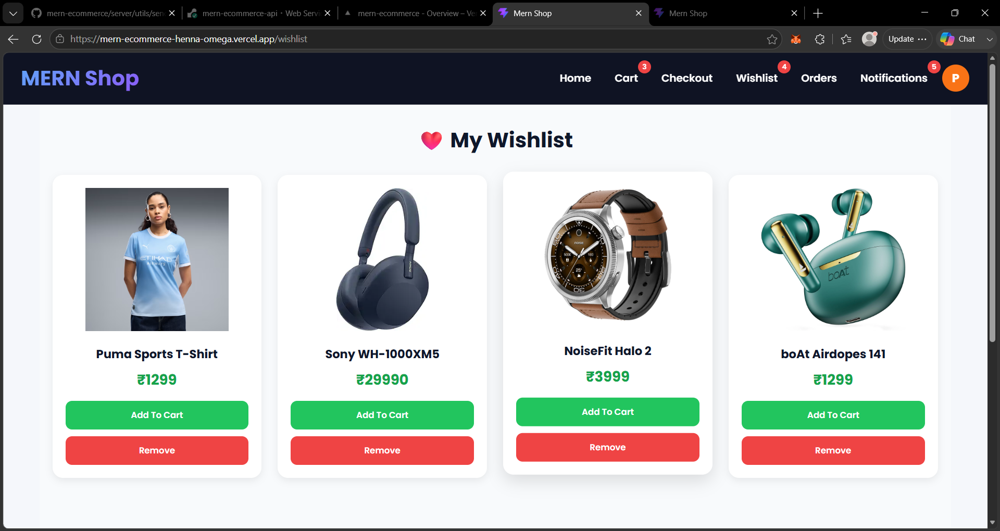

---

### 💳 Checkout Page

Displays:

- Shipping address
- Payment method
- Order summary
- Razorpay integration

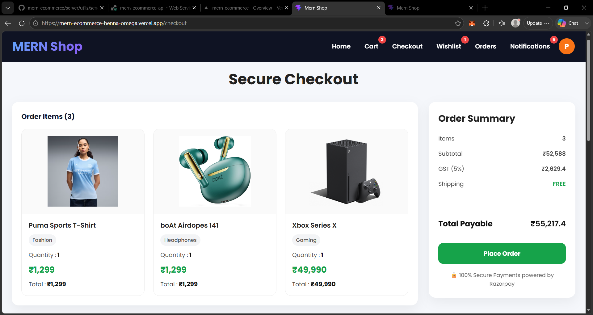

---

### 👤 Profile Page

Displays:

- User details
- Email verification
- Password reset
- Order history

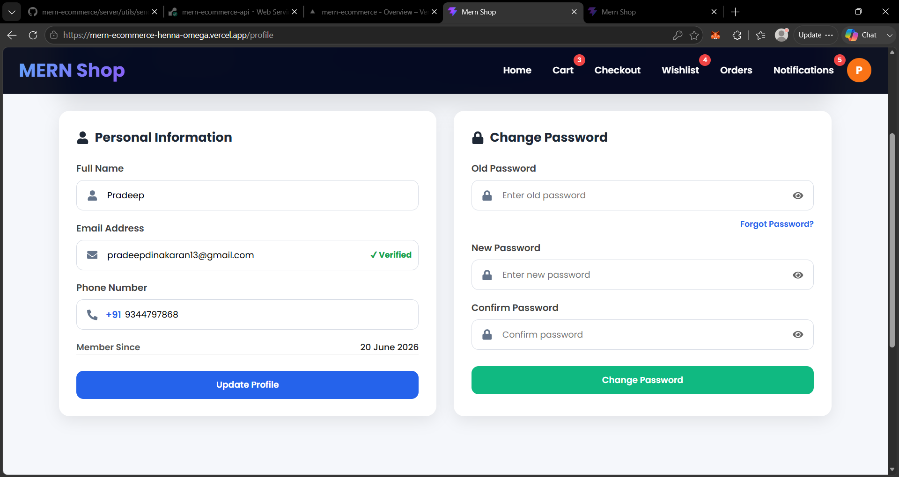

---

### 🔔 Notifications Page

Displays:

- Order updates
- Read and unread notifications

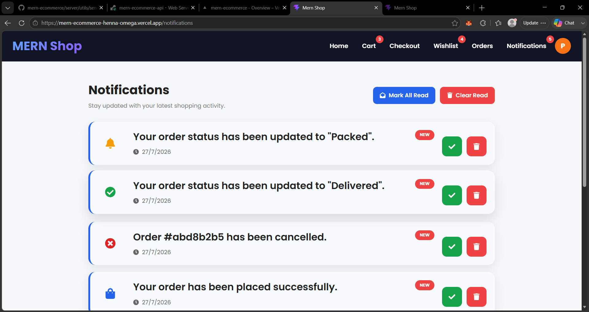

---

### 📦 Orders Page

Displays:

- Order history
- Delivery status
- Invoice download

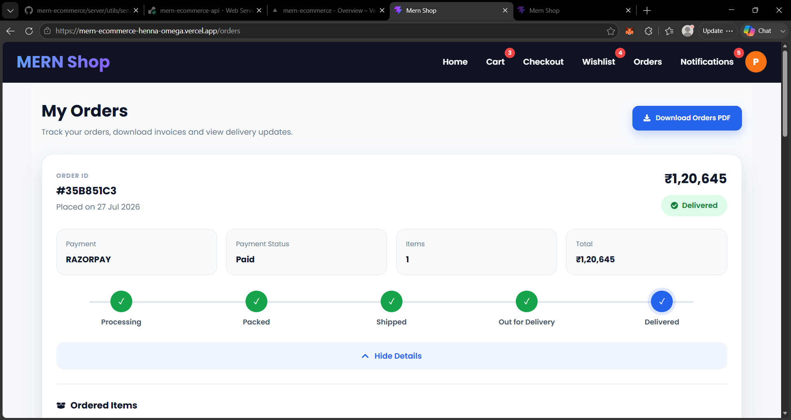

---

### 👨‍💼 Admin Dashboard

Displays:

- Revenue analytics
- Sales charts
- User statistics
- Order statistics

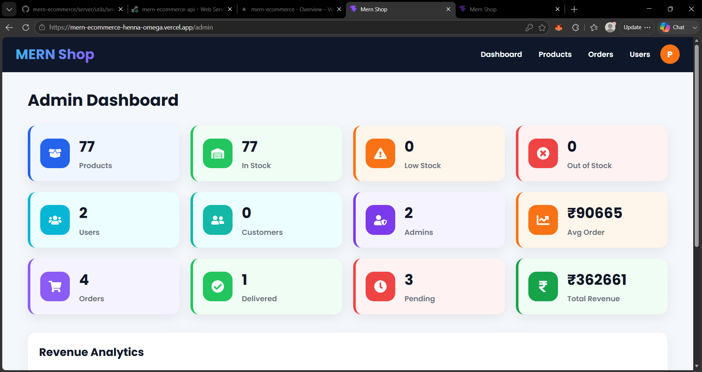

---

### 🛠️ Admin Product Management

Displays:

- Add products
- Edit products
- Delete products

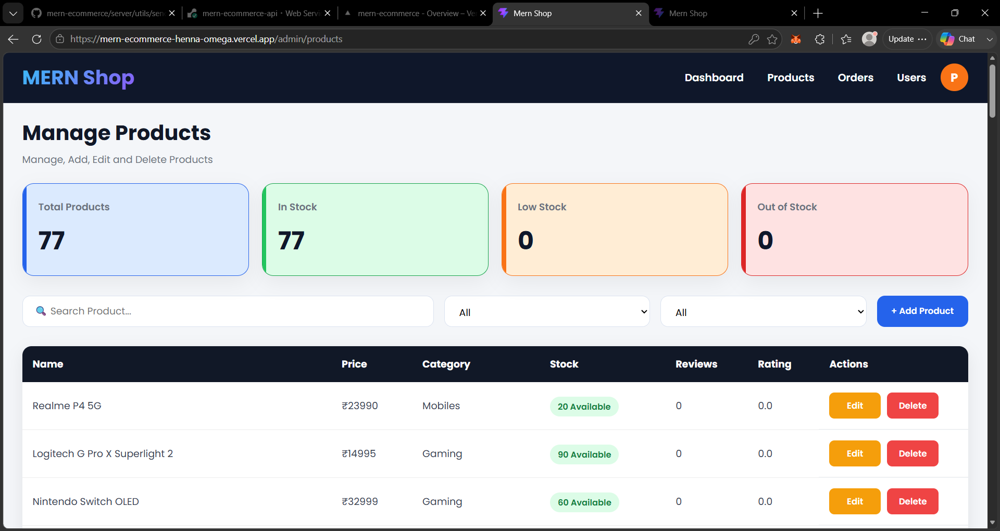

---

### 📋 Admin Order Management

Displays:

- View orders
- Change order status

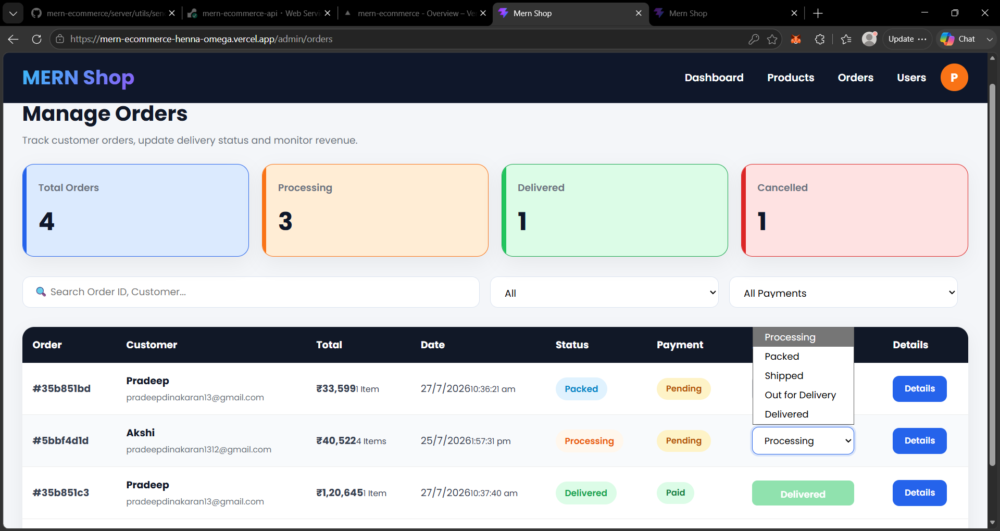

---

## ⚙️ Installation

### Clone the repository

```bash
git clone https://github.com/luvpradeep/mern-ecommerce.git
```

---

### Install frontend dependencies

```bash
cd client
npm install
npm run dev
```

---

### Install backend dependencies

```bash
cd server
npm install
npm start
```

---

## 🔐 Environment Variables

Create a `.env` file inside the server directory.

```env
PORT=5000

MONGO_URI=

JWT_SECRET=

CLOUDINARY_CLOUD_NAME=

CLOUDINARY_API_KEY=

CLOUDINARY_API_SECRET=

EMAIL_USER=

EMAIL_PASS=

RAZORPAY_KEY_ID=

RAZORPAY_KEY_SECRET=
```

---

Create a `.env` file inside the client directory.

```env
VITE_API_URL=
VITE_RAZORPAY_KEY=
```

---

## 🧩 Implemented Modules

### Authentication

- Register
- Login
- Logout
- Email verification
- OTP verification
- Password reset

### Products

- Product listing
- Search
- Filters
- Sorting
- Pagination

### Shopping Cart

- Add items
- Remove items
- Increase quantity
- Decrease quantity

### Wishlist

- Add products
- Remove products

### Orders

- Place orders
- Track orders
- Download invoices

### Notifications

- Read notifications
- Delete notifications

---

## 📈 Upcoming Features

- Coupon system
- AI chatbot
- Dark mode
- Multi-language support
- Product recommendations
- Advanced reports
- Inventory management

---

## 👨‍💻 Author

### Pradeep Dinakaran

Frontend Developer | MERN Stack Developer

GitHub:

https://github.com/luvpradeep

---

## ⭐ Support

If you like this project, don't forget to give it a star on GitHub.

```
⭐ Star this repository if you found it helpful.
```